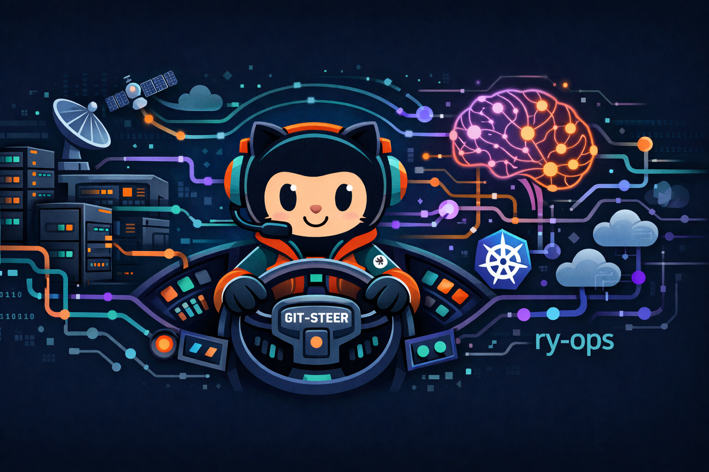

<div align="center">
  
</div>

# 👋 Hey, I'm ry-ops

[](https://ry-ops.dev) [](https://patreon.com/ry_ops) [](https://github.com/ry-ops)    

> Building the pipes between infrastructure, automation, and observability.

## 🚀 What I Do

I specialize in **network infrastructure automation** and **AI-assisted operations**. My repositories focus on bridging enterprise networking gear with modern monitoring, automation workflows, and AI tooling through MCP (Model Context Protocol) servers.

### 🎯 Core Focus Areas

**Network Infrastructure & Automation**
- Building solutions for UniFi network ecosystems
- Starlink Enterprise integration and management
- Dynamic DNS automation with Cloudflare
- Real-time event streaming to observability platforms

**MCP Server Development**
- Creating MCP servers that enable AI assistants to interact with infrastructure
- Supporting platforms like UniFi, Proxmox, n8n, K3s, and Starlink Enterprise
- Making network operations AI-accessible and conversational

**Observability & Monitoring**
- Real-time event streaming from network devices to Grafana
- Infrastructure metrics collection and alerting
- CI/CD-friendly monitoring deployments

---

## 🛠️ Featured Projects

<div align="center">

### 🌟 Flagship Projects

<table>
<tr>
<td width="50%">
<h3 align="center">🚜 Git-Steer</h3>
<div align="center">
<a href="https://github.com/ry-ops/git-steer">

</a>
<br><br>
<p><strong>TypeScript</strong> - Self-hosting GitHub autonomy engine. Full control over repos, branches, security, and Actions through natural language via MCP. Zero local footprint—your PC or Mac is just the steering wheel.</p>
<a href="https://ry-ops.dev/posts/2026-02-01-git-steer">

</a>
</div>
</td>
<td width="50%">
<h3 align="center">🧠 Cortex</h3>
<div align="center">
<a href="https://github.com/ry-ops/cortex">

</a>
<br><br>
<p><strong>Python</strong> - Multi-agent AI system for autonomous GitHub repository management. Self-improving with RLHF feedback loops, self-evaluation gates, and adaptive task routing.</p>
<a href="https://ry-ops.dev/meet-cortex">

</a>
</div>
</td>
</tr>
</table>

### 🔌 MCP Servers

<table>
<tr>
<td width="33%">
<h3 align="center">🌐 UniFi MCP</h3>
<div align="center">
<a href="https://github.com/ry-ops/unifi-mcp-server">

</a>
<br><br>
<p><strong>Python</strong> - Comprehensive UniFi infrastructure monitoring and management with A2A support.</p>

</div>
</td>
<td width="33%">
<h3 align="center">🖥️ Proxmox MCP</h3>
<div align="center">
<a href="https://github.com/ry-ops/proxmox-mcp-server">

</a>
<br><br>
<p><strong>Python</strong> - Manage Proxmox VMs, containers, storage, and cluster resources via AI.</p>

</div>
</td>
<td width="33%">
<h3 align="center">☸️ K3s MCP</h3>
<div align="center">
<a href="https://github.com/ry-ops/k3s-mcp-server">

</a>
<br><br>
<p><strong>Python</strong> - K3s cluster management with kubectl operations for Claude.</p>

</div>
</td>
</tr>
<tr>
<td width="33%">
<h3 align="center">☁️ Cloudflare MCP</h3>
<div align="center">
<a href="https://github.com/ry-ops/cloudflare-mcp-server">

</a>
<br><br>
<p><strong>Python</strong> - Manage DNS, workers, and infrastructure through natural language.</p>

</div>
</td>
<td width="33%">
<h3 align="center">🤖 n8n MCP</h3>
<div align="center">
<a href="https://github.com/ry-ops/n8n-mcp-server">

</a>
<br><br>
<p><strong>Python</strong> - Integrate AI with n8n workflow automation.</p>

</div>
</td>
<td width="33%">
<h3 align="center">🛰️ Starlink MCP</h3>
<div align="center">
<a href="https://github.com/ry-ops/starlink-enterprise-mcp-server">

</a>
<br><br>
<p><strong>Python</strong> - Monitor Starlink Enterprise connectivity and status.</p>

</div>
</td>
</tr>
</table>

### 🛠️ Tools & Utilities

<table>
<tr>
<td width="33%">
<h3 align="center">🚗 DriveIQ</h3>
<div align="center">
<a href="https://github.com/ry-ops/DriveIQ">

</a>
<br><br>
<p><strong>Python</strong> - Vehicle management with maintenance tracking and AI-powered manual consultation.</p>

</div>
</td>
<td width="33%">
<h3 align="center">📄 ATSFlow</h3>
<div align="center">
<a href="https://github.com/ry-ops/ATSFlow">

</a>
<br><br>
<p><strong>JavaScript</strong> - AI-powered resume optimization for ATS/LPS compatibility.</p>

</div>
</td>
<td width="33%">
<h3 align="center">🌐 UniFi DDNS</h3>
<div align="center">
<a href="https://github.com/ry-ops/unifi-cloudflare-ddns">

</a>
<br><br>
<p><strong>TypeScript</strong> - Dynamic DNS for UniFi devices using Cloudflare Workers.</p>

</div>
</td>
</tr>
</table>

</div>

---

## 💡 Why These Projects?

Modern infrastructure deserves modern tooling. My projects aim to:

- **Automate the boring stuff** → DDNS updates, event forwarding, metrics collection
- **Bridge AI and Ops** → Make infrastructure queryable and manageable through conversation
- **Embrace GitOps** → Version-controlled configs, repeatable deployments, CI/CD integration
- **Open source everything** → Community-driven improvements and shared knowledge

---

## 🔧 Tech Stack

```yaml
Languages:       Python, TypeScript, JavaScript, Go
Infrastructure:  UniFi, Proxmox, Cloudflare, Starlink, Talos Linux, K3s
Platforms:       Kubernetes, Docker, GitHub Actions
Observability:   Grafana, Prometheus, Netdata, CheckMK
Automation:      n8n, MCP Servers, GitHub Actions
Web:             Astro, Cloudflare Pages
AI/ML:           Claude AI, MCP Protocol, LLM Integration
```

---

## 📊 DevOps Philosophy

I believe in:
- **Infrastructure as Code** → Everything version-controlled
- **Observability First** → If you can't measure it, you can't improve it
- **Automation Over Manual** → Humans are expensive and error-prone
- **AI-Augmented Ops** → Let AI help with routine tasks and troubleshooting

---

## 📚 Latest from the Blog

Check out [ry-ops.dev](https://ry-ops.dev) for tutorials, project deep-dives, and infrastructure guides:

- [Git-Steer: A Self-Hosting GitHub Autonomy Engine](https://ry-ops.dev/posts/2026-02-01-git-steer)
- [Building Your First MCP Server](https://ry-ops.dev/posts/creating-your-first-mcp-server)
- [Deploying Your First Kubernetes Cluster](https://ry-ops.dev/posts/deploying-your-first-kubernetes-cluster)

---

## 🤝 Support & Contributions

If you find these projects useful, consider:
- ⭐ Starring the repositories
- 🐛 Opening issues for bugs or feature requests
- 🔀 Submitting pull requests
- ☕ Supporting via [Patreon](https://patreon.com/ry_ops)

---

## 📫 Connect

- 🌐 Blog: [ry-ops.dev](https://ry-ops.dev)
- 💻 GitHub: [@ry-ops](https://github.com/ry-ops)
- 💖 Patreon: [ry_ops](https://patreon.com/ry_ops)
- 📍 Location: Duluth, Minnesota

---

<div align="center">
  <sub>Built with ❤️ and way too much coffee</sub>
</div>
