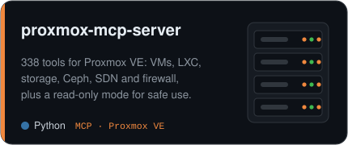
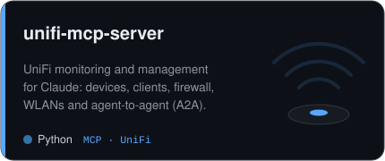
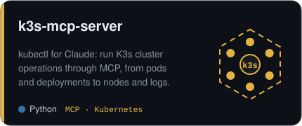
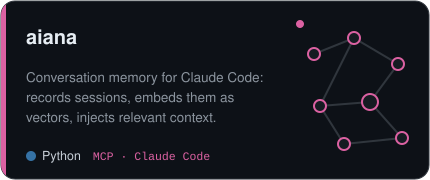
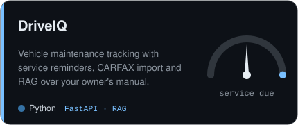
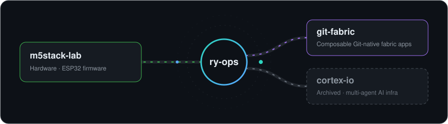
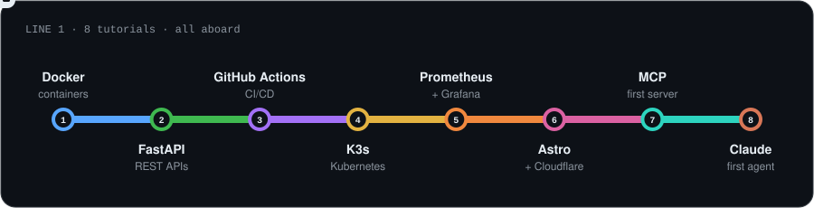

<a href="https://ry-ops.dev"></a>

  
  
  

I build the plumbing that lets AI run real infrastructure: **MCP servers** that give Claude hands on Proxmox, UniFi, Kubernetes, Cloudflare and more; **agent frameworks** for security and GitHub ops; and **ESP32 firmware** for the M5Stack gear on my desk. Everything starts in a homelab in Superior, Wisconsin.



## 🔌 The MCP fleet

Each of these is a Model Context Protocol server: plug it into Claude and the platform becomes something you can just *talk to*.



## 🛠️ Featured builds

<a href="https://github.com/ry-ops/proxmox-mcp-server"></a> <a href="https://github.com/ry-ops/unifi-mcp-server"></a>
<a href="https://github.com/ry-ops/mr-robot"></a> <a href="https://github.com/ry-ops/git-steer"></a>
<a href="https://github.com/ry-ops/k3s-mcp-server"></a> <a href="https://github.com/ry-ops/aiana"></a>
<a href="https://github.com/ry-ops/stackforge"></a> <a href="https://github.com/ry-ops/DriveIQ"></a>

## 🔬 Hardware lab

ESP32 firmware for M5Stack devices lives in its own org, **[m5stack-lab](https://github.com/m5stack-lab)**.

<a href="https://github.com/m5stack-lab"></a>

- **[cardputer-adv-mirror](https://github.com/m5stack-lab/cardputer-adv-mirror)**: mirror a Cardputer ADV display in any browser over WiFi
- **[tab5-mirror](https://github.com/m5stack-lab/tab5-mirror)**: the same for the Tab5, plus remote control
- **[Liner](https://github.com/m5stack-lab/Liner)**: now-playing e-paper display for Volumio
- **[doomagotchi](https://github.com/m5stack-lab/doomagotchi)**: self-playing DOOM where live RF becomes demons

## 🏢 Organizations



<a href="https://github.com/m5stack-lab"><b>m5stack-lab</b></a> · hardware &amp; firmware &nbsp;&nbsp;|&nbsp;&nbsp;
<a href="https://github.com/git-fabric"><b>git-fabric</b></a> · composable fabric apps &nbsp;&nbsp;|&nbsp;&nbsp;
<a href="https://github.com/cortex-io"><b>cortex-io</b></a> · the archive

## 🎓 Learn with me

Eight hands-on tutorials, from your first container to your first Claude agent.



| | | | |
|---|---|---|---|
| **1** [Docker containers](https://github.com/ry-ops/getting-started-docker-containers) | **2** [REST APIs with FastAPI](https://github.com/ry-ops/building-rest-api-fastapi) | **3** [CI/CD with GitHub Actions](https://github.com/ry-ops/setting-up-cicd-github-actions) | **4** [Kubernetes with K3s](https://github.com/ry-ops/deploying-your-first-kubernetes-cluster) |
| **5** [Prometheus + Grafana](https://github.com/ry-ops/monitoring-infrastructure-prometheus-grafana) | **6** [Serverless with Astro + Cloudflare](https://github.com/ry-ops/building-serverless-website-github-cloudflare) | **7** [Your first MCP server](https://github.com/ry-ops/creating-your-first-mcp-server) | **8** [Your first Claude agent](https://github.com/ry-ops/building-your-first-claude-agent) |

## ✍️ Latest from the blog

<!-- BLOG:START -->
- [RAG vs Fine-Tuning: A Decision Framework for Production](https://ry-ops.dev/posts/2026-08-07-rag-vs-fine-tuning-decision-framework-production/) · Aug 7, 2026
- [7 SSH Settings Your Server Has Wrong Right Now](https://ry-ops.dev/posts/2026-08-04-7-ssh-settings-your-server-has-wrong-right-now/) · Aug 4, 2026
- [AI Code Generators: The Translation Engine Engineers Need to Understand](https://ry-ops.dev/posts/2026-08-02-ai-code-generators-translation-engine-engineers/) · Aug 2, 2026
- [Kubernetes vs Nomad: Stop Using K8s by Default](https://ry-ops.dev/posts/2026-07-29-kubernetes-vs-nomad-stop-using-k8s-by-default/) · Jul 29, 2026
- [Stop Stuffing Your LLM Context: The Lost in the Middle Problem](https://ry-ops.dev/posts/2026-07-18-lost-in-the-middle-llm-context-problem/) · Jul 18, 2026
<!-- BLOG:END -->

More at **[ry-ops.dev](https://ry-ops.dev)**.

## 🗂️ Everything else

<b>Every public repo, grouped</b> (refreshed weekly)

<!-- INVENTORY:START -->
**🔌 MCP servers**

| Repo | What it is | ★ |
|---|---|--:|
| [proxmox-mcp-server](https://github.com/ry-ops/proxmox-mcp-server) | MCP server for managing Proxmox Virtual Environment VMs, containers, storage, and cluster resources | 26 |
| [unifi-mcp-server](https://github.com/ry-ops/unifi-mcp-server) | MCP server for the full UniFi Network API, cloud-only through unifi.ui.com (fork) | 15 |
| [k3s-mcp-server](https://github.com/ry-ops/k3s-mcp-server) | MCP server for K3s: tools for workloads, troubleshooting, rollouts and server-side apply, scoped by your kubeconfig's RBAC | 5 |
| [starlink-enterprise-mcp-server](https://github.com/ry-ops/starlink-enterprise-mcp-server) | MCP server for managing Starlink terminal fleet through the Starlink Enterprise API | 3 |
| [cloudflare-mcp-server](https://github.com/ry-ops/cloudflare-mcp-server) | Cloudflare MCP Server | 2 |
| [microsoft-graph-mcp-server](https://github.com/ry-ops/microsoft-graph-mcp-server) | MCP server integrating Microsoft Graph API for managing Microsoft 365 users, licenses, and groups | 2 |
| [qdrant-fabric](https://github.com/ry-ops/qdrant-fabric) | Model Context Protocol server for Qdrant - Part of Infrastructure as a Fabric ecosystem. Provides 30+ tools for vector database operations, semantic search, and AI memory management. | 2 |
| [aiana](https://github.com/ry-ops/aiana) | AI conversation attendant for Claude Code - monitors and records conversations in real-time via Claude Code API | 1 |
| [eagle-scout](https://github.com/ry-ops/eagle-scout) | MCP server for Docker Scout - container security scanning | 1 |
| [git-steer](https://github.com/ry-ops/git-steer) | Self-hosting GitHub autonomy engine. Rate-limit-hardened MCP server for autonomous repo management, security sweeps, RFC tracking, and CI orchestration. Zero local footprint — steering wheel on your Mac, engine on GitHub. 🚜 | 1 |
| [n8n-fabric](https://github.com/ry-ops/n8n-fabric) | Workflow automation fabric layer - n8n MCP server with Qdrant vectors and Redis caching | 1 |

**🔬 Hardware · m5stack-lab**

| Repo | What it is | ★ |
|---|---|--:|
| [m5stack-lab/cardputer-adv-mirror](https://github.com/m5stack-lab/cardputer-adv-mirror) | Mirror an M5Stack Cardputer ADV display in a web browser over WiFi (ESP32-S3, GRAM readback via SPI, WebSocket streaming) | 2 |
| [m5stack-lab/doomagotchi](https://github.com/m5stack-lab/doomagotchi) | Self-playing DOOM on an M5Stack Tab5 that turns live 2.4 GHz RF into demons | 1 |
| [m5stack-lab/Liner](https://github.com/m5stack-lab/Liner) | Now-playing display for Volumio on the M5Stack PaperColor e-paper board | 1 |
| [m5stack-lab/tab5-mirror](https://github.com/m5stack-lab/tab5-mirror) | Browser display mirror + remote control for the M5Stack Tab5, forked from cardputer-adv-mirror | 1 |

**🎓 Tutorials**

| Repo | What it is | ★ |
|---|---|--:|
| [building-rest-api-fastapi](https://github.com/ry-ops/building-rest-api-fastapi) | Build blazing-fast REST APIs with FastAPI, automatic docs, and type safety | 1 |
| [building-serverless-website-github-cloudflare](https://github.com/ry-ops/building-serverless-website-github-cloudflare) | Build lightning-fast serverless websites with Astro, GitHub, and Cloudflare Pages | 1 |
| [building-your-first-claude-agent](https://github.com/ry-ops/building-your-first-claude-agent) | Learn to build intelligent agents with Claude that automate your workflow | 1 |
| [creating-your-first-mcp-server](https://github.com/ry-ops/creating-your-first-mcp-server) | Extend Claude with custom tools by building Model Context Protocol servers | 1 |
| [deploying-your-first-kubernetes-cluster](https://github.com/ry-ops/deploying-your-first-kubernetes-cluster) | Deploy production-ready Kubernetes clusters with K3s | 1 |
| [getting-started-docker-containers](https://github.com/ry-ops/getting-started-docker-containers) | Package applications into portable containers with Docker | 1 |
| [monitoring-infrastructure-prometheus-grafana](https://github.com/ry-ops/monitoring-infrastructure-prometheus-grafana) | Monitor infrastructure with Prometheus metrics and Grafana dashboards | 1 |
| [setting-up-cicd-github-actions](https://github.com/ry-ops/setting-up-cicd-github-actions) | Automate testing and deployment with GitHub Actions CI/CD pipelines | 1 |

**🧪 Tools & experiments**

| Repo | What it is | ★ |
|---|---|--:|
| [commit-relay](https://github.com/ry-ops/commit-relay) | Autonomous multi-agent AI platform for GitHub repository lifecycle management. MoE routing, self-healing workers, LLM mesh gateway, RAG-enhanced context, enterprise governance. [Archived] | 2 |
| [mr-robot](https://github.com/ry-ops/mr-robot) | An ADR-driven security framework for Kali — a HackTheBox co-pilot orchestrating Hat-persona Claude agents across a shared arcade and a cross-engagement memory layer. | 2 |
| [git-fabric/adr](https://github.com/git-fabric/adr) | Global Architecture Decision Records for the git-fabric organization | 1 |
| [git-fabric/aiana](https://github.com/git-fabric/aiana) | Aiana memory fabric app — semantic memory, session context, and cross-project recall as a composable MCP layer | 1 |
| [git-fabric/aiana-vllm](https://github.com/git-fabric/aiana-vllm) | AIANA-Ops — Ollama Modelfile for AIANA semantic memory layer (fabric-llm L5 memory primitive) | 1 |
| [ATSFlow](https://github.com/ry-ops/ATSFlow) | AI-powered resume optimization tool that matches resumes to job descriptions and ensures ATS/LPS compatibility | 1 |
| [azure-help](https://github.com/ry-ops/azure-help) | Notes and playbooks for the non-obvious corners of the Azure portal | 1 |
| [bloatkill](https://github.com/ry-ops/bloatkill) | Windows storage cleanup reference: a zero-dependency audit dashboard | 1 |
| [capture-cadence](https://github.com/ry-ops/capture-cadence) | Scheduled full-page website screenshot automation. Puppeteer + Express.js with web UI, custom intervals, WebP output, and Docker support. [Archived] | 1 |
| [git-fabric/chat](https://github.com/git-fabric/chat) | Chat fabric app — AI conversation sessions, semantic history search, and context threading as a composable MCP layer | 1 |
| [git-fabric/cloudflare](https://github.com/git-fabric/cloudflare) | Cloudflare fabric app — DNS, zones, cache, and KV as a composable MCP layer | 1 |
| [git-fabric/cloudflare-vllm](https://github.com/git-fabric/cloudflare-vllm) | Cloudflare-Ops — API-specialized Ollama Modelfile for Cloudflare v4 API (fabric-llm L3+L7 edge) | 1 |
| [git-fabric/cve](https://github.com/git-fabric/cve) | CVE detection-to-remediation fabric app. Scan, enrich, triage, and fix vulnerabilities across managed repos. | 1 |
| [git-fabric/cve-vllm](https://github.com/git-fabric/cve-vllm) | CVE-Ops — API-specialized Ollama Modelfile for NVD/GHSA/CISA KEV CVE pipeline (fabric-llm L3+L7 vuln intel) | 1 |
| [DriveIQ](https://github.com/ry-ops/DriveIQ) | Intelligent vehicle management app — maintenance tracking, service reminders, CARFAX integration, and AI-powered manual consultation for any vehicle. | 1 |
| [eagle-scout-extension](https://github.com/ry-ops/eagle-scout-extension) | Docker Desktop extension for Docker Scout security scanning | 1 |
| [git-fabric/fabric-ctrl](https://github.com/git-fabric/fabric-ctrl) | Zero-trust control plane for the git-fabric org. GitHub App identity, security automation, and MCP org tooling. | 1 |
| [git-fabric/fabric-forge](https://github.com/git-fabric/fabric-forge) | Forge the fabric. k3s cluster + Helm charts for the Fabric-SDK runtime. One script, full stack. | 1 |
| [git-fabric/fabric-invoke-vllm](https://github.com/git-fabric/fabric-invoke-vllm) | fabric-invoke — Ollama Modelfile for orchestration runtime intelligence (L4+L6 interceptor) | 1 |
| [git-fabric/fabric-review](https://github.com/git-fabric/fabric-review) | Automated PR review engine for the git-fabric ecosystem | 1 |
| [git-fabric/fabric-router-vllm](https://github.com/git-fabric/fabric-router-vllm) | fabric-router — Ollama Modelfile for fabric-sdk meta-routing intelligence (L3+L4 gateway) | 1 |
| [git-fabric/fabric-state](https://github.com/git-fabric/fabric-state) | CVE queue state and scan history for fabric-ctrl | 1 |
| [fortigate-mcp-server](https://github.com/ry-ops/fortigate-mcp-server) | MCP server for managing Fortinet FortiGate firewalls (FortiOS 7.6 REST API) with AI | 1 |
| [git-fabric/gateway](https://github.com/git-fabric/gateway) | Fabric gateway — routes, connects, and orchestrates git-fabric apps. The connective tissue. | 1 |
| [git-fabric/git](https://github.com/git-fabric/git) | Git operations fabric app — commit, push, branch, PR, and repo management as a composable MCP layer | 1 |
| [git-fabric/git-steer-vllm](https://github.com/git-fabric/git-steer-vllm) | git-steer-Ops — Ollama Modelfile for git-steer internal architecture (fabric-llm meta-layer) | 1 |
| [git-fabric/github-vllm](https://github.com/git-fabric/github-vllm) | GitHub-Ops — API-specialized Ollama Modelfile for GitHub REST API (fabric-llm L3+L5+L6+L7 substrate) | 1 |
| [git-fabric/k3s-vllm](https://github.com/git-fabric/k3s-vllm) | k3s/Kubernetes API intelligence model — fabric-llm | 1 |
| [git-fabric/k8s](https://github.com/git-fabric/k8s) | Kubernetes operations fabric app — cluster, pods, deployments, services, and logs as a composable MCP layer | 1 |
| [git-fabric/n8n-vllm](https://github.com/git-fabric/n8n-vllm) | n8n-Ops — API-specialized Ollama Modelfile for n8n REST API v1 (fabric-llm L5+L6+L7 orchestration) | 1 |
| [git-fabric/pipelines](https://github.com/git-fabric/pipelines) | Automated fabric pipelines — composing gateway tools into ambient homelab intelligence | 1 |
| [git-fabric/proxmox](https://github.com/git-fabric/proxmox) | Proxmox VE fabric app — VMs, containers, nodes, storage, and snapshots as a composable MCP layer | 1 |
| [git-fabric/proxmox-vllm](https://github.com/git-fabric/proxmox-vllm) | Proxmox VE API intelligence model — fabric-llm | 1 |
| [git-fabric/qdrant-vllm](https://github.com/git-fabric/qdrant-vllm) | qdrant-fabric — Ollama Modelfile for Qdrant vector ops intelligence (L3+L6 foundry) | 1 |
| [rawk-on](https://github.com/ry-ops/rawk-on) | Add songs from The Current's on-air playlist to a daily TIDAL or Spotify playlist — a Chrome (MV3) extension. | 1 |
| [git-fabric/sandfly](https://github.com/git-fabric/sandfly) | Sandfly Security fabric app — agentless Linux intrusion detection and incident response as a composable MCP layer | 1 |
| [git-fabric/sandfly-vllm](https://github.com/git-fabric/sandfly-vllm) | Sandfly-Ops — API-specialized Ollama Modelfile for Sandfly Security v4 API (fabric-llm L3+L5 security) | 1 |
| [git-fabric/sdk](https://github.com/git-fabric/sdk) | Fabric-SDK — BGP-style routing layer for autonomous fabric agents. Route locally first, Claude only when nobody else can answer. | 1 |
| [stackforge](https://github.com/ry-ops/stackforge) | A guided homelab infrastructure bootstrapper. k3s on bare-metal, k3d on Docker Desktop. One script, choose your adventure. | 1 |
| [git-fabric/tailscale](https://github.com/git-fabric/tailscale) | Tailscale fabric app — devices, DNS, ACL, and auth keys as a composable MCP layer | 1 |
| [git-fabric/tailscale-vllm](https://github.com/git-fabric/tailscale-vllm) | Tailscale-Ops — API-specialized Ollama Modelfile for Tailscale v2 API (fabric-llm L1 transport) | 1 |
| [git-fabric/terminal](https://github.com/git-fabric/terminal) | Claude Code + tmux + kubectl in a persistent container. Accessible via Tailscale or kubectl exec. | 1 |
| [git-fabric/unifi](https://github.com/git-fabric/unifi) | UniFi fabric app — hosts, sites, and devices via the UI.com Cloud API as a composable MCP layer | 1 |
| [unifi-cloudflare-ddns](https://github.com/ry-ops/unifi-cloudflare-ddns) | Cloudflare Worker enabling UniFi devices to dynamically update DNS A/AAAA records | 1 |
| [git-fabric/unifi-vllm](https://github.com/git-fabric/unifi-vllm) | UniFi API intelligence model — fabric-llm | 1 |
| [git-fabric/yt-adr-feed](https://github.com/git-fabric/yt-adr-feed) | YouTube transcript monitor — Qdrant vector storage + GitHub ADR pipeline. Deterministic, no generative AI at runtime. | 1 |
| [beowulf-ai-cluster](https://github.com/ry-ops/beowulf-ai-cluster) | AI Cluster deployed with Ansible on Random computers with random capabilities (fork) | 0 |

**🗄️ Archive · cortex-io**

| Repo | What it is | ★ |
|---|---|--:|
| [cortex-io/cortex](https://github.com/cortex-io/cortex) | Archived — AI-powered autonomous DevOps platform with multi-agent orchestration, neural routing, and self-healing infrastructure. | 1 |
| [cortex-io/cortex-construction-hq](https://github.com/cortex-io/cortex-construction-hq) | Archived — Cortex Holdings project management: roadmap, phase tracking, build session logs. | 1 |
| [cortex-io/cortex-docs](https://github.com/cortex-io/cortex-docs) | Archived — Cortex knowledge base: Obsidian vault with architecture decisions, runbooks, and component docs. | 1 |
| [cortex-io/cortex-gitops](https://github.com/cortex-io/cortex-gitops) | Archived — GitOps manifests for Cortex K3s deployments. ArgoCD-managed, self-healing Kubernetes infrastructure. | 1 |
| [cortex-io/cortex-k3s](https://github.com/cortex-io/cortex-k3s) | Archived — K3s cluster documentation: Wazuh security, KEDA autoscaling, and monitoring stack. | 1 |
| [cortex-io/cortex-layer-stack](https://github.com/cortex-io/cortex-layer-stack) | Archived — Helm chart for scale-to-zero AI service stacks with telemetry-driven model distillation. | 1 |
| [cortex-io/cortex-platform](https://github.com/cortex-io/cortex-platform) | Archived — Cortex platform monorepo: microservices, MCP servers, shared libraries, and agent coordination. | 1 |
| [cortex-io/infrastructure-docs](https://github.com/cortex-io/infrastructure-docs) | Archived — Homelab infrastructure documentation: Proxmox, K3s, networking, and service configs. | 1 |
<!-- INVENTORY:END -->

